# FortiGate Lab: VLAN, LAN, DHCP & DNS Configuration

This lab demonstrates how to configure core networking services in a FortiGate Firewall environment, including:

LAN configuration
VLAN segmentation
DHCP configuration
DNS configuration
WAN internet connectivity
Basic routing and interface troubleshooting

The goal was to simulate a small enterprise network using FortiGate.

### 1️ Configuring the LAN Interface/IP
- We edit the defalt internal interface, manually assign and IP Address and netmask, and configure administrative access(HTTPS,Ping,SSH)

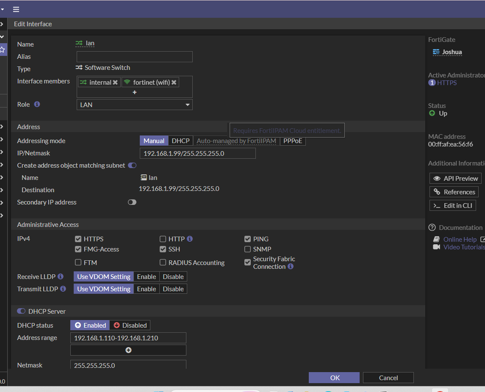
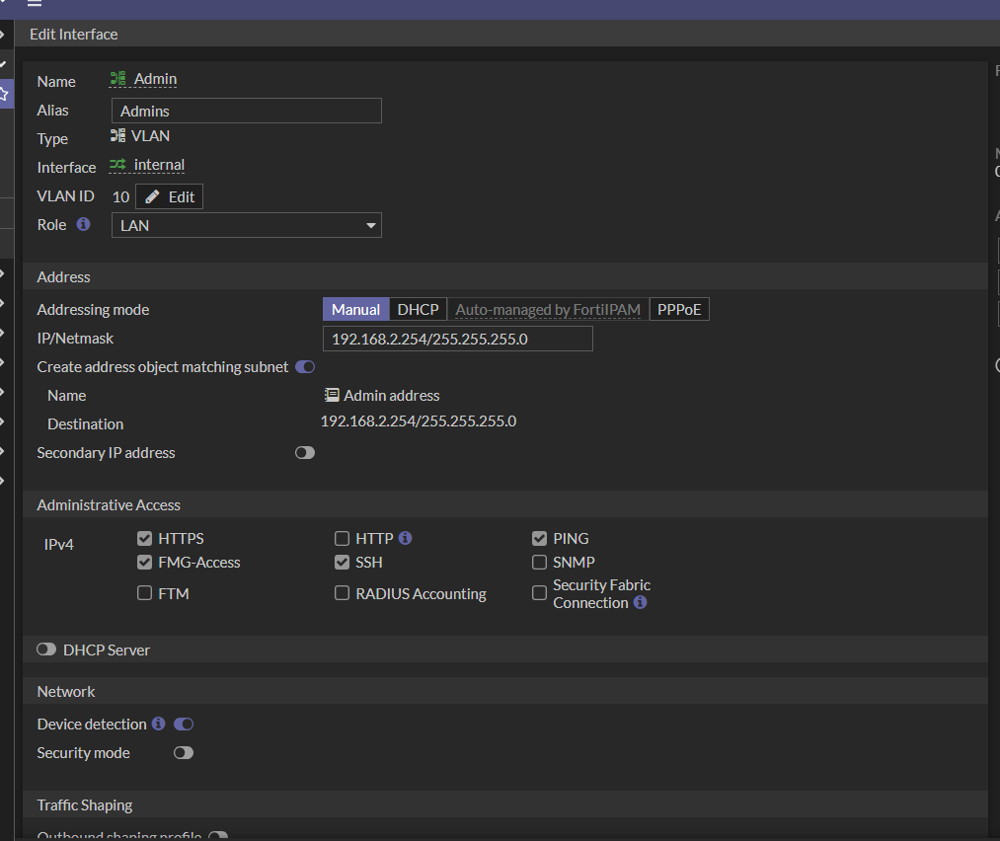
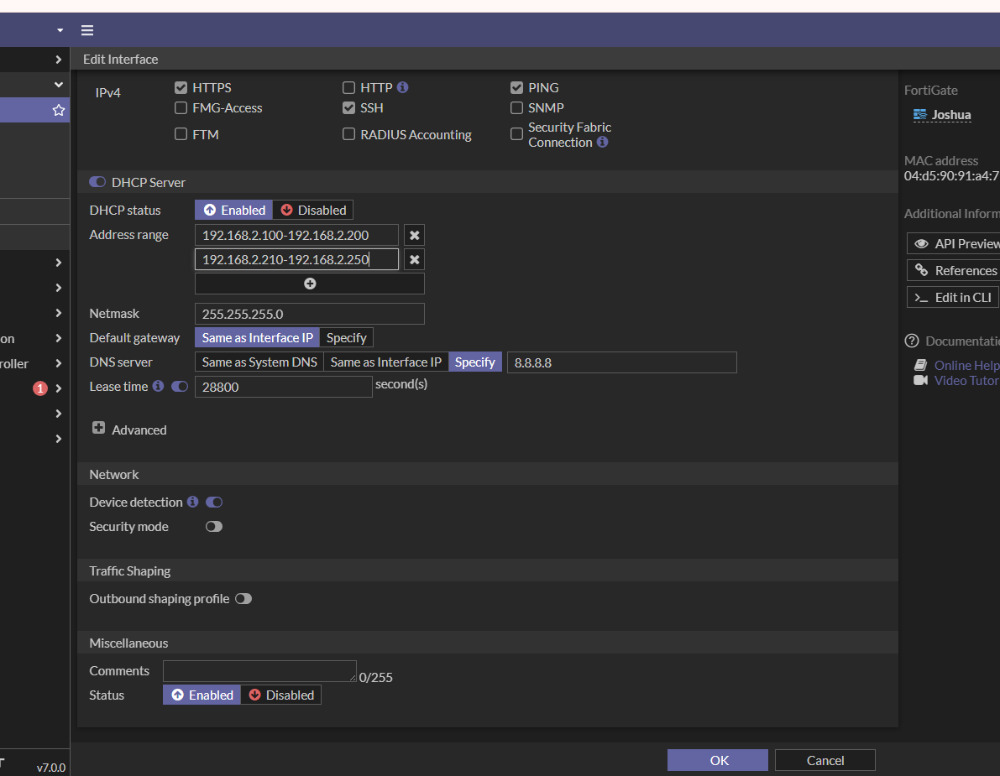
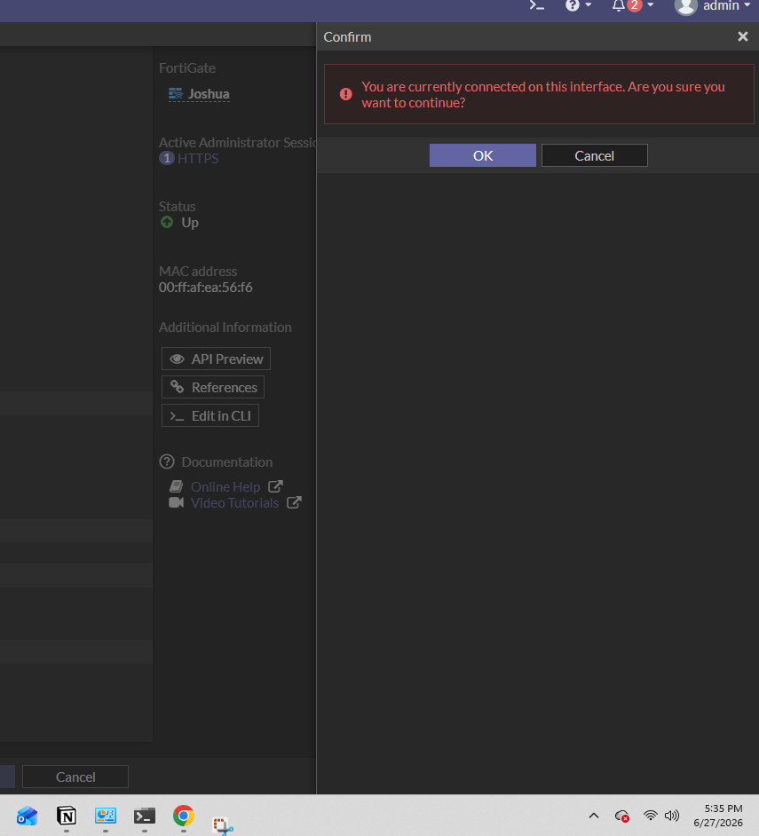

- In screenshot 4 you can see that it's asking us if we are ok with changing it because we are changing the default gateway IP address
- We need to relogin with the new gateway IP address, just copy the gateway IP and click ok
- Login with the new gateway IP address
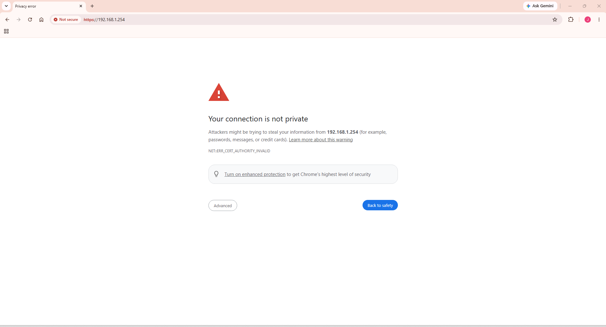
- Once you login back in go to Network --> Interfaces
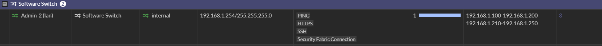

### Creating a VLAN Interface
#### Network --> Interfaces ---> New 
- Give it a name, I decided that I want to name it Admin
- Give it a VLAN ID
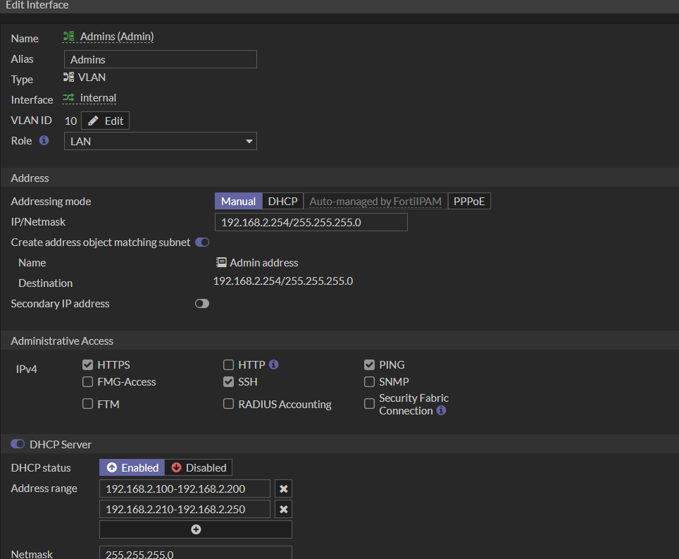
- The role should be LAN
- Addressing Mode should be Manual since we are giving it a Manual IP address
- IP/NetMask assign the ip address that you want to assign for this interface
- Administrative Access : always keep **HTTPS, PING, SSH** to be able to troubleshoot the system
- Enable DHCP server
  
- **Remember** : Don't include the gateway within the range
- DNS server : you specify to go back to google.com DNS --> 8.8.8.8
- This is a VLAN server

- IF you want to see more configuratons with VLAN ID you can go at the top and click settings
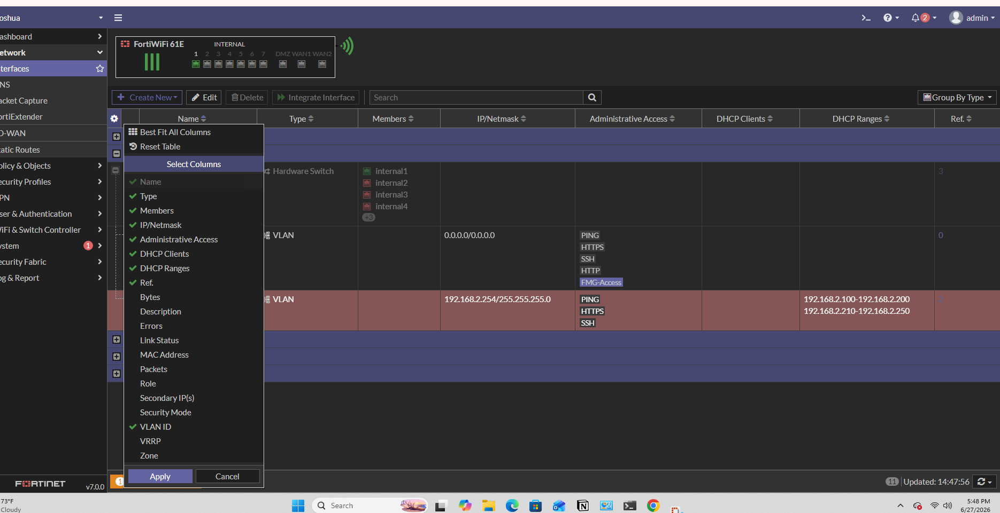
- Click VLAN ID and show you all of the configurations
- drag the bar to the right you will see all the VLAN ID
### Creating One More VLAN
- Network ---> Interfaces
- Create New --> Interfaces
- Guest **Type** VLAN
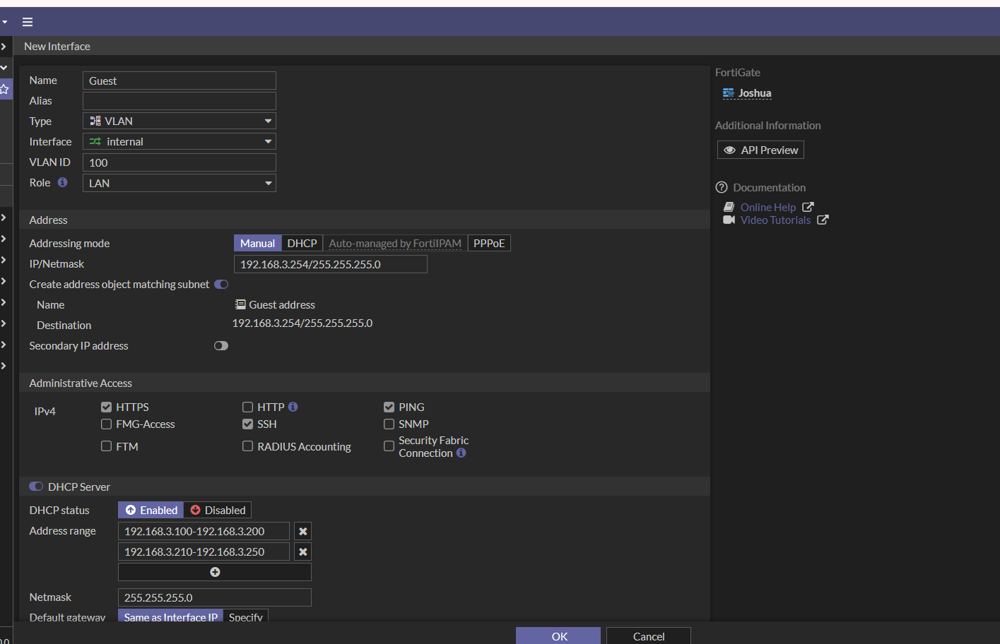
- Give it the same roles as last one
- Give it a different VLAN ID
- Depending on what you need it for, you can give it a bigger range
- **Remember** : Don't include the gateway within the range
- DNS server : you specify to go back to google.com DNS --> 8.8.8.8
- This is a VLAN server
- Addressing Mode should be Manual since we are giving it a Manual IP address
- IP/NetMask assign the ip address that you want to assign for this interface
- Administrative Access : always keep **HTTPS, PING, SSH** to be able to troubleshoot the system
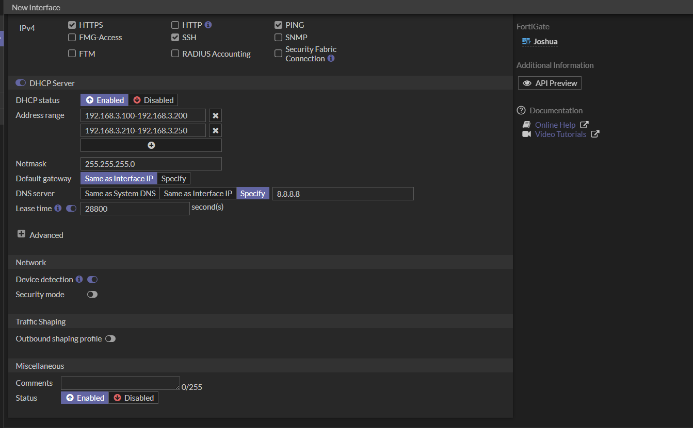
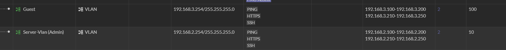
- We now have two VLAN assigned to this interface
