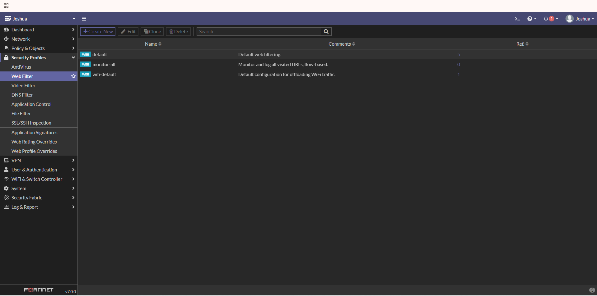
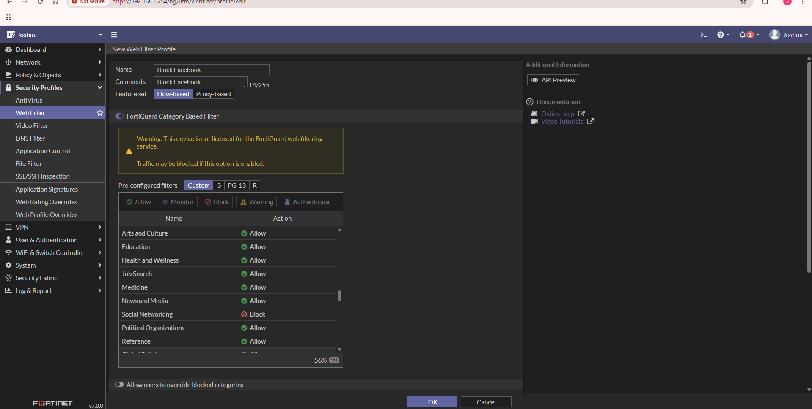
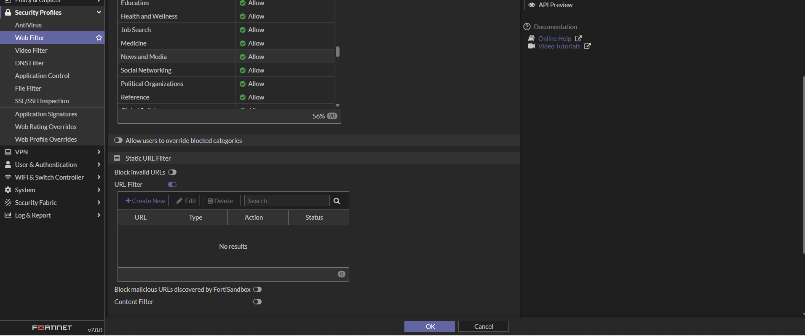
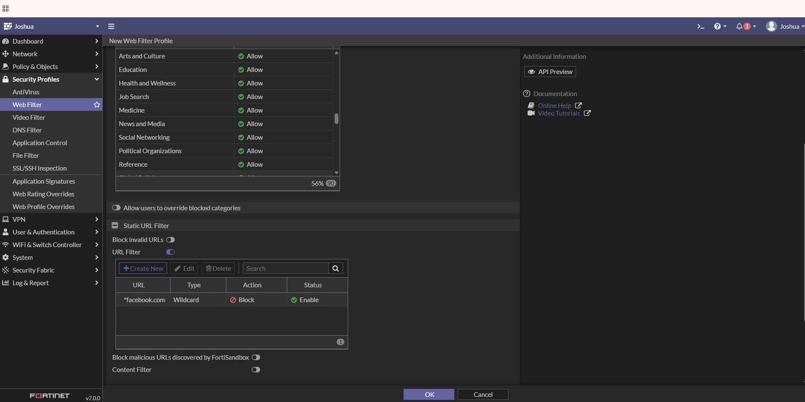
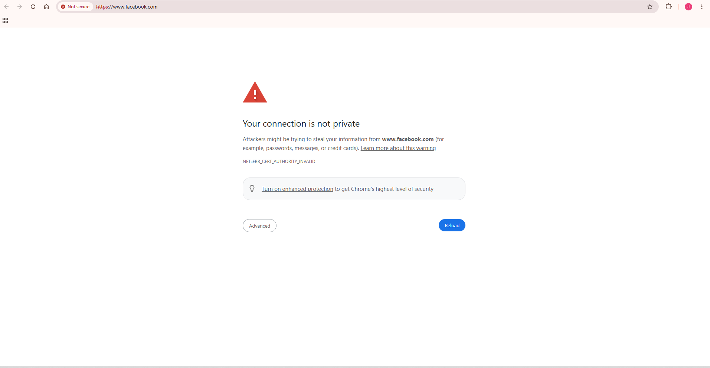
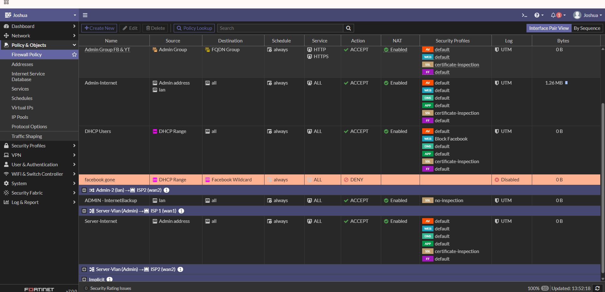
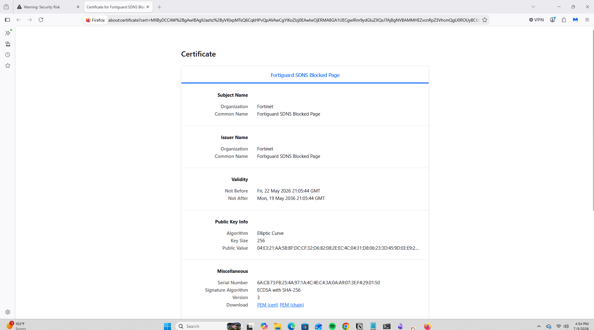
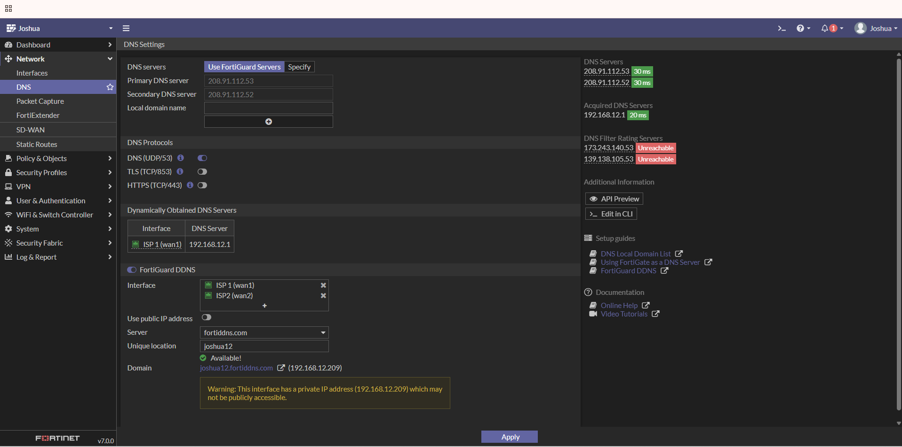

# Website Blocking with FortiGate Firewall

## Overview

This project demonstrates how to configure website filtering on a FortiGate firewall by creating a custom Web Filter profile, blocking Facebook using a Static URL Filter, applying the profile to a firewall policy, and validating that access to the website is successfully denied.

This lab simulates how organizations restrict access to specific websites to improve security, enforce acceptable use policies, and reduce exposure to malicious or non-business web traffic.

---

## Objective

Configure FortiGate to block access to Facebook while allowing normal internet connectivity for authorized users.

---

## Technologies Used

- FortiGate Firewall v7.0
- Web Filter
- Static URL Filter
- Firewall Policies
- HTTPS Inspection
- DNS Filtering
- FortiGuard DNS
- Web Browser for Testing

---

## Skills Demonstrated

- FortiGate Administration
- Firewall Policy Configuration
- Web Filtering
- Static URL Filtering
- HTTPS Inspection
- DNS Configuration
- Enterprise Network Security
- Security Validation
- Network Troubleshooting

---

# Website Blocking Methods

FortiGate provides multiple methods for blocking websites depending on whether the firewall has an active FortiGuard license.

## Method 1: Security Profiles (Requires FortiGuard License)

### Category-Based Filtering

Uses FortiGuard Web Filtering to block entire categories of websites such as:

- Social Networking
- Gambling
- Streaming Media
- Adult Content
- Malware

This is useful when organizations want to block groups of websites instead of individual domains.

---

### Static URL Filter

Allows administrators to block individual websites by creating custom URL entries.

Example:

```
*facebook.com
```

This blocks:

```
facebook.com
www.facebook.com
m.facebook.com
business.facebook.com
```

This is the method demonstrated in this project.

---

### Content Filter

Content Filtering blocks websites based on keywords or specific URL patterns rather than entire domains.

---

### Applying the Web Filter

After creating the Web Filter profile, it must be applied to the appropriate Firewall Policy under:

```
Policy & Objects
    └── Firewall Policy
```

For HTTPS traffic, SSL/HTTPS Inspection should also be enabled so encrypted traffic can be inspected and filtered correctly.

---

## Method 2: FQDN Address Blocking (Works Without a FortiGuard License)

If the FortiGuard subscription has expired, websites can still be blocked by creating a Fully Qualified Domain Name (FQDN) Address Object.

Example:

```
*.facebook.com
```

The FQDN Address Object is then used as the destination inside a Firewall Policy configured with the **Deny** action.

This method does not require FortiGuard Web Filtering and is commonly used on expired or unlicensed FortiGate firewalls.

---

## Testing

After configuring either method:

1. Open a browser from a client machine.
2. Browse to the blocked website.
3. Verify the website cannot be reached.
4. Review firewall logs to confirm traffic was denied.

---

# Network Environment

Firewall

```
FortiGate VM
```

LAN

```
Internal Network
```

WAN

```
ISP1
```

Test Website

```
Facebook
```

---

# Step 1: Navigate to Web Filter

Navigate to:

```
Security Profiles
    └── Web Filter
```

Click **Create New** to create a custom Web Filter Profile.



---

# Step 2: Create a New Web Filter Profile

Configure the following:

Name

```
Block Facebook
```

Comments

```
Block Facebook
```

Feature Set

```
Flow-Based
```

Because this FortiGate does not have an active FortiGuard license, the Static URL Filter is used instead of FortiGuard Category Filtering.



---

# Step 3: Configure the Static URL Filter

Scroll down to the **Static URL Filter** section.

Enable:

```
URL Filter
```

Click:

```
Create New
```

Configure:

URL

```
*facebook.com
```

Type

```
Wildcard
```

Action

```
Block
```

Status

```
Enable
```

Using a wildcard ensures every Facebook subdomain is blocked.

Examples include:

```
facebook.com
www.facebook.com
m.facebook.com
business.facebook.com
```



---

# Step 4: Verify the Static URL Filter

Verify the entry appears exactly as configured.

URL

```
*facebook.com
```

Action

```
Block
```

Status

```
Enabled
```



---

# Step 5: Apply the Web Filter Profile

Navigate to:

```
Policy & Objects
    └── Firewall Policy
```

Edit the LAN-to-WAN firewall policy.

Enable the Web Filter Security Profile.

Select:

```
Block Facebook
```

Save the firewall policy.

This applies the custom Web Filter to all traffic matching the policy.



---

# Step 6: Test Website Blocking

Open a browser on a client machine.

Navigate to:

```
https://www.facebook.com
```

The browser should no longer be able to access Facebook.

Depending on SSL Inspection and browser behavior, users may receive a security warning or a FortiGate block page.



---

# Step 7: Verify the Blocked Certificate

Inspect the certificate presented after the block.

The certificate shows:

Organization

```
Fortinet
```

Common Name

```
FortiGuard SDNS Blocked Page
```

This confirms the request was intercepted and blocked by the FortiGate firewall.



---

# DNS Configuration

The firewall is configured to use FortiGuard DNS servers.

Primary DNS

```
208.91.112.53
```

Secondary DNS

```
208.91.112.52
```

FortiDDNS is also configured on the firewall.



---

# Verification Checklist

✅ Created a custom Web Filter Profile

✅ Configured a Static URL Filter

✅ Used a wildcard domain

✅ Applied the Web Filter to a Firewall Policy

✅ Verified HTTPS traffic was blocked

✅ Confirmed the Fortinet blocked certificate

✅ Validated DNS configuration

---

# What I Learned

This project gave me hands-on experience configuring website filtering with a FortiGate firewall. I learned how Web Filter profiles integrate with firewall policies to control web traffic, how Static URL Filters can block specific domains using wildcard entries, and how HTTPS inspection influences web filtering. I also reinforced my understanding of DNS configuration, policy evaluation, and traffic validation while troubleshooting blocked web requests.

---

## Future Improvements

- Block multiple social media websites
- Configure Category-Based Filtering with a licensed FortiGuard subscription
- Create time-based web filtering schedules
- Configure logging and reporting for blocked websites
- Integrate authentication-based web filtering
- Create separate policies for different VLANs or user groups
- Monitor blocked traffic using FortiAnalyzer

---

## Repository Structure

```
FortiGate-Website-Blocking/
│
├── README.md
│
├── images/
│   ├── website1.png
│   ├── website2.png
│   ├── website3.png
│   ├── website4.png
│   ├── website9.png
│   ├── website10.png
│   ├── website11.png
│   └── website12.png
```

---

## References

- Fortinet Administration Guide
- FortiGate Security Profiles Documentation
- FortiGuard Web Filtering Documentation
